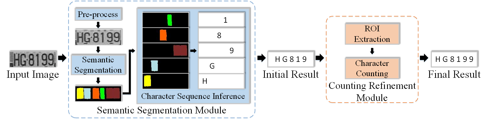
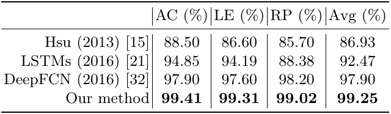
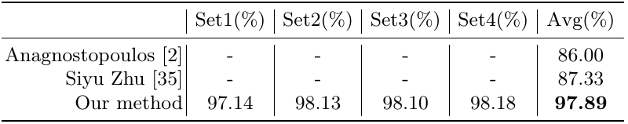
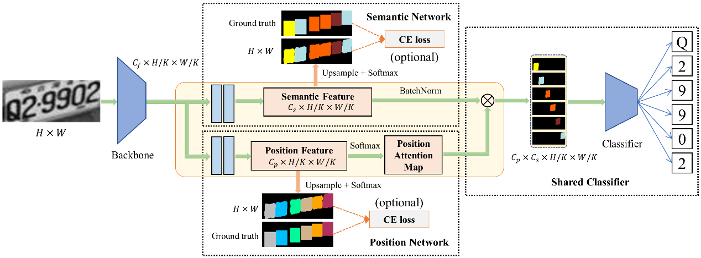
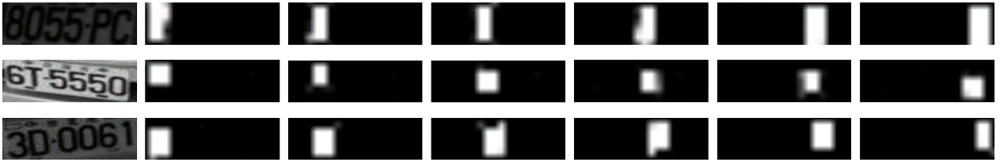
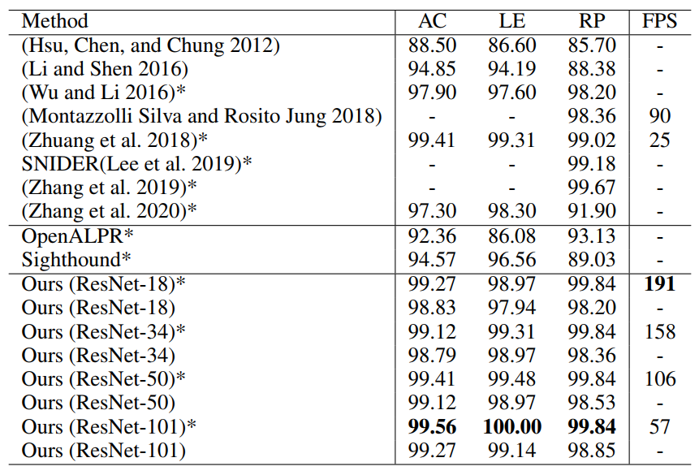
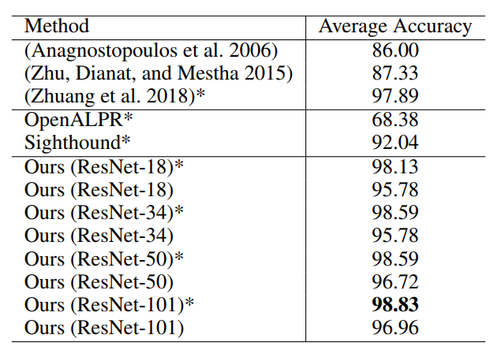

This repository is the introduction of "Towards human-level license plate recognition"(ECCV2018) and "Efficient License Plate Recognition via Holistic Position Attention"(AAAI2021) from USTC VIM Lab. They are designed for accurate and efficient license plate recognition.

# Towards human-level license plate recognition
## Abstract
License plate recognition (LPR) is a fundamental component of various intelligent transport systems, which is always expected to be accurate and efficient enough. In this paper, we propose a novel LPR framework consisting of semantic segmentation and character counting, towards achieving human-level performance. Benefiting from innovative structure, our method can recognize a whole license plate once rather than conducting character detection or sliding window followed by per-character recognition. Moreover, our method can achieve higher recognition accuracy due to more effectively exploiting global information and avoiding sensitive character detection, and is time-saving due to eliminating one-by-one character recognition. Finally, we experimentally verify the effectiveness of the proposed method on two public datasets (AOLP and Media Lab) and our License Plate Dataset. The results demonstrate our method significantly outperforms the previous state-of-the-art methods, and achieves the accuracies of more than 99% for almost all settings.

## Framework
The framework consists of two key modules: semantic segmentation and counting refinement. The semantic segmentation module is to produce the semantic map and initial character sequence, which includes pre-processing, semantic segmentation, and character sequence inference. The counting refinement module is to generate the final character sequence through counting characters.

## Performance on the AOLP dataset

## Performance on the Media Lab dataset

# Efficient License Plate Recognition via Holistic Position Attention
## Abstract
License plate recognition (LPR)	is a fundamental component of various intelligent transportation systems, and is always expected to be accurate and efficient enough in real-world applications. Nowadays, recognition of single character has been sophisticated  benefiting from the power of deep learning, and extracting position information for forming a character sequence becomes the main bottleneck of LPR. To tackle this issue, we propose a novel holistic position attention (HPA) in this paper that consists of position network and shared classifier. Specifically, the position network explicitly encodes the character position into the maps of HPA, and then the shared classifier performs the character recognition in a unified and parallel way. Here the extracted features are modulated by the attention maps before feeding into the classifier to yield the final recognition results. Note that our proposed method is end-to-end trainable, character recognition can be concurrently performed, and no post-processing is needed. Thus our LPR system can achieve good effectiveness and efficiency simultaneously. The experimental results on four public datasets, including AOLP, Media Lab, CCPD, and CLPD, well demonstrate the superiority of our method to previous state-of-the-art methods in both accuracy and speed.

## Framework
Illustration of our proposed LPR method, which consists of four main components: backbone network, semantic network, position network, and shared classifier. Backbone network is to extract the global features of input image. Semantic network and position network are to produce semantic features and position attention maps, respectively. Shared classifier is to perform character recognition that takes the semantic features modulated by the attention maps. Here Cf is the channel number of the global features, and Cp, Cs are the number of characters in a license plate and number of character classes, respectively.

## Visualization of HPA maps
Visualization of HPA maps. Here the attention maps for different characters in a license plate are orderly exhibited from left to right.

## Performance on the AOLP dataset

## Performance on the Media Lab dataset

